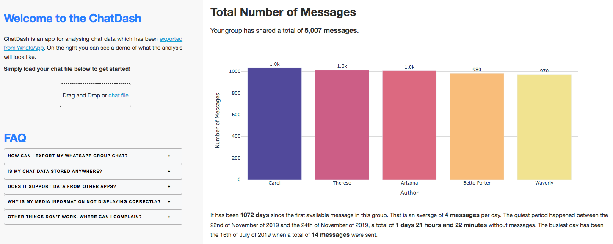

# ChatDash

## About

ChatDash is an app created with [Dash](https://dash.plot.ly/) for analysing chat data which has been exported from WhatsApp. The analysis include (for now):
* Overall number of messages
* Busiest month of the year, day of the week, time of the day
* User responding patterns
* Group's favourite emojis
* Media sharing patterns
* Word cloud
* Random messages turned in random inspirational quotes

### How to locally run this app

**NOTE:** when locally running this app, the last section (i.e. random messages turned into quotes) won't work as it relies on having an Unsplash access key. If you wish to have that working, head over to [Unsplash](https://unsplash.com/developers) to get an aceess for making API requests. Once you have an acess key, either hard code it [here](https://github.com/natworks/chatdash/blob/9c1d06f620037f45c381d072484e8825b0131d7c/data_analysis.py#L22), or create a `.env` file in your project root and include your key there.

```
git clone https://github.com/natworks/chatdash
cd chatdash
python3 -m virtualenv chatdash
```

Install requirements:
```
pip install -r requirements.txt
```

Run:
```
python app.py
```

### Screenshot



### Resources

* The app layout has been (**heavily**) inspired by [Clinical Analytics Dashboard](https://dash.gallery/dash-clinical-analytics/)
* Parsing Whatsapp files has been made robust by using parts of the code available in [whatstk's parser](https://github.com/lucasrodes/whatstk/blob/main/whatstk/whatsapp/parser.py)
* Images for generating the quotes come from [unsplash](https://unsplash.com)
* The default chat was generated with [DeepAi's text generator](https://deepai.org/machine-learning-model/text-generator)
